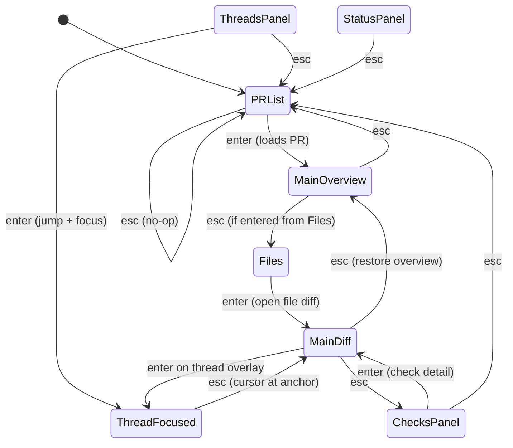
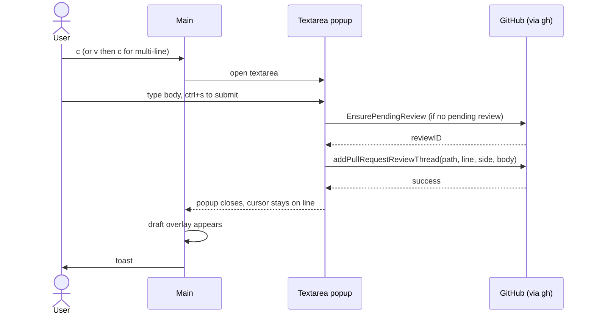
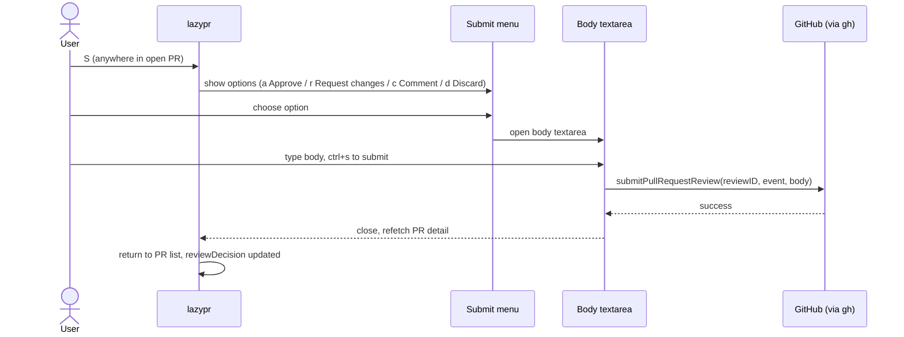
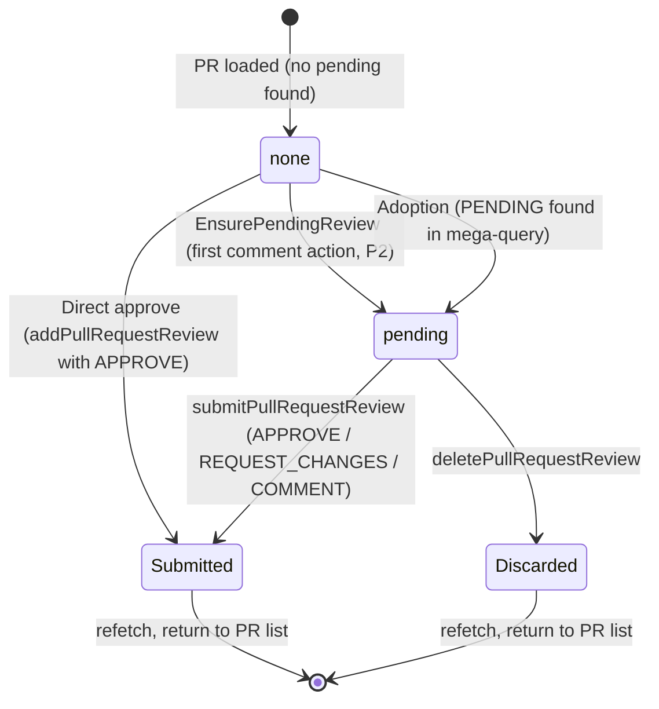

# lazypr — Technical & UX Specification

> See also: [Product Requirements Document](PRD.md)

## 1. Overview & goals

**lazypr** (binary: `lazypr`) is a keyboard-driven terminal UI for GitHub pull request review — the reviewer-side complement to lazygit. Its thesis: reviewing on github.com is slow and mousy — large diffs collapse aggressively, threads scatter across the page, pending review drafts live in fragile browser state, and CI is buried in separate tabs. lazypr collapses the entire reviewer loop — triage → diff → comment → approve/request-changes → merge — into one spatial, keyboard-operated interface using lazygit's proven panel model.

**The gap this fills.** `gh-dash` is a dashboard/launcher with no inline review. `octo.nvim` is a full review client but Neovim-only. `prr` does offline file annotation but cannot read threads. `gh pr review` handles body-level reviews only, no inline comments. No standalone TUI ships diff + thread overlay + batched pending review + resolve + CI + merge in a single interface.

**Five product pillars drive every design decision in this spec:**

1. **Spatial UI you never re-learn.** Five numbered side panels, one main pane, lazygit DNA throughout.
2. **Batch-first reviewing.** The server-side PENDING review is the core object. Draft comments are always visible, navigable, editable pre-submit, and adopted if started in the web UI — the "lost draft review" failure mode is eliminated.
3. **Entire loop without leaving the terminal.** From triage through merge, every reviewer action is available without opening a browser.
4. **Transparency.** Every `gh` invocation is streamed to a command log with duration and exit code. No magic.
5. **Zero-config on top of `gh`.** Auth is borrowed from `gh auth login`; no token management.

**Scope constraints (v1):** No AI-assisted review features in any phase. No PR authoring (create/edit PR, push code) beyond checkout handoff. GitLab and Bitbucket are excluded from v1 behind a forge abstraction seam.

**Delivery:** Phased — Phase 1 (read + triage), Phase 2 (authoring), Phase 3 (power loop). Full feature requirements, personas, acceptance criteria, and phase gate definitions are in [PRD.md](PRD.md).

## 2. Runtime prerequisites

| Prerequisite | Requirement |
|---|---|
| `gh` CLI | ≥ 2.40, on `PATH`, authenticated (`gh auth status` passes) |
| git | Optional — required only for checkout (`C`) and open-in-editor (`e`) features (Phase 3) |
| Terminal dimensions | ≥ 80 columns × 24 rows recommended minimum |
| Truecolor support | Optional — degrades gracefully to 256-color or 16-color |

## 3. CLI invocation

```
lazypr [flags] [<number> | <url> | <owner>/<repo>#<number>]
```

**Flags:**

| Flag | Description |
|---|---|
| `--repo <owner/name>` | Override repo (instead of resolving from cwd via `gh repo view`) |
| `--debug` | Write debug log to `$XDG_STATE_HOME/lazypr/debug.log` |

**Positional argument forms:**

| Form | Example |
|---|---|
| PR number | `lazypr 123` |
| PR URL | `lazypr https://github.com/owner/repo/pull/123` |
| Owner/repo#number | `lazypr owner/repo#123` |
| (none) | Opens PR list for the cwd repo |

**Exit codes:**

| Code | Meaning |
|---|---|
| `0` | Clean exit |
| `1` | Fatal startup failure (`gh` missing / unauthed / no repo resolvable) |
| `2` | Bad arguments |

If no repo is resolvable and `--repo` is not given, a full-screen error state names the fix. If `gh` is missing or unauthed, a dedicated full-screen state shows `gh auth login` instructions (probe: `gh auth status`).

## 4. Layout & screen modes

```
╭─[1]─Status────────────┬─[0]─Main───────────────────────────────╮
│ repo, user, PENDING…  │                                        │
├─[2]─Pull Requests─────┤   PR description (glamour markdown)    │
│   #142 Fix auth race  │   or file diff with inline thread      │
├─[3]─Files─────────────┤   overlays, or thread detail, or       │
│ ✓ src/auth.ts  +12 −3 │   check output                         │
├─[4]─Threads───────────┤                                        │
│ ● src/auth.ts:88 …    │                                        │
├─[5]─Checks────────────┼────────────────────────────────────────┤
│ ✓ build  ✗ lint       │ command log: gh api graphql … (280ms)  │
╰───────────────────────┴────────────────────────────────────────╯
  status bar: context-sensitive key hints (reflects the ACTIVE TAB, not just the panel)
```

**Proportions and sizing:**

- Left column default 1/3 width (`gui.sidePanelWidth: 0.3333`), right main pane 2/3.
- Command log bottom-right (`gui.commandLogSize: 8` lines; toggle via `@`).
- One-line hint bar at the bottom reflects the ACTIVE TAB, not just the panel.
- **Equal-height browsers:** the three browser panels (`[2]` Pull Requests, `[3]` Files, `[4]` Threads) always share one height. Focus never resizes them — the left column must not reflow every time focus moves. (`gui.expandFocusedSidePanel` is still accepted for config compatibility but no longer does anything.)
- **Height-collapsible panels — Status `[1]` and Checks `[5]`:** when NOT focused, these panels shrink to a boxed one-liner (3 rows: top border + one content line + bottom border); when focused, they grow to fit their own content, capped so the browsers keep a 3-row minimum. Focused with no data to show, they stay at the collapsed height. The freed height flows to the browser panels, which always divide it evenly. Because Status/Checks are pinned at 3 and the browsers must stay exactly equal, a pool that is not divisible by three leaves up to 2 rows unused at the bottom of the left column.

**Panels and their tabs** (tabs cycled with `[` / `]`):

| Panel | Tabs | Notes |
|---|---|---|
| **[1] Status** | (none) | Repo `owner/name`, viewer login, `reviewDecision`, requested reviewers, rate-limit remaining, pending review banner: `PENDING review: 4 draft comments (S to submit)`. Height-collapsible: when not focused it shrinks to a one-line box showing its first line (the repo); when focused it expands to the full status view. |
| **[2] Pull Requests** | `Review requested` / `Mine` / `All open` / `Search` | First three tabs fetch server-side on switch (`gh pr list --search "<q> sort:updated-desc" --limit 50`; `<q>` = `review-requested:@me` \| `author:@me` \| `""`). `/` then filters that loaded set client-side. `Search` tab: `/` opens an input for a free-form GitHub search query (supports `is:merged`, `label:bug`, `author:x`, etc.); `enter` runs it server-side (`--state all --limit 100`). Non-open results show a `[merged]` or `[closed]` tag alongside `[draft]`. |
| **[3] Files** | `Files` / `Commits` | Commits tab = Phase 3. Tree view default; `` ` `` toggles flat (flat shows full paths). Single-child directory chains compress into one row (`pkg/ui/keymap/`) so deep Go paths stay readable. Directory rows carry a `▾`/`▸` fold caret and their subtree's aggregate `+N -N`, and a `✓` once every file beneath them is viewed. Add/delete counters are right-aligned at the panel edge and are **never** clipped — an over-long path truncates from the left (`…files_controller.go`) so the identifying basename survives. |
| **[4] Threads** | `Unresolved` / `All` / `Drafts` | Drafts tab = Phase 2; tabs render in the panel's top border title, lazygit-style: `╭─[4]─[Unresolved] - All - Drafts─…╮` — active tab bracketed, joined with ` - `, no content row consumed; same for PRs and Checks panels |
| **[5] Checks** | `Checks` / `Timeline` | When **not focused**: collapses to a single summary line — `✓ CI passing`, `✗ N checks failing`, `◔ N checks running`, or `(no checks)` — and border title is `Checks`. When **focused**: expands to the full `Checks` / `Timeline` tabbed view with the tab bar in the border title (lazygit-style, same as other panels). |

**Screen modes** (`+` / `_` cycle through):

| Mode | Description |
|---|---|
| `normal` | Default: left column 1/3, main 2/3 |
| `half` | Left column 1/2, main 1/2 |
| `fullscreen` | Main pane takes the full terminal |

**Portrait mode:** automatically activated when terminal width < 90 columns; panels stack vertically above the main pane.

## 5. Contexts & focus model

lazypr maintains a **real focus stack**, not a hardcoded panel chain. At any moment exactly one context is focused. The key properties:

- `1`–`5` jump directly to the corresponding panel; `0` jumps to the **PR overview** in Main from anywhere (restoring it if Main was showing a diff).
- `esc` **pops** to the context you drilled in from — it never jumps to a hardcoded destination. One exception: when Main is focused and showing a file diff, the first `esc` restores the PR overview (focus stays on Main); the next `esc` pops.
- `q` (only) quits; `esc` at the top level (PR list, nothing drilled) is a no-op.

**Entry paths into Main and their `esc` return targets:**

| Entry | Path | esc return |
|---|---|---|
| Files → Main | `enter` on file → Main diff at that file | overview (still Main); second `esc` → Files |
| Threads → Main | `enter` on thread → Main diff at thread anchor (thread-focused) | Main cursor at anchor; then `esc` → Threads |
| Checks → Main | `enter` on check → Main check detail | Checks |
| PR list → Main | `enter` on PR → (loads PR) → Main shows PR overview (focused) | PR list |
| Top level | `esc` at PR list, nothing drilled | no-op |

**Thread-focused context:** a nested context within the Main pane, active when the cursor lands on a thread overlay and you press `enter` (or arrive via Threads panel `enter`). Thread-focused keys are listed in §6. `esc` returns to the Main cursor at the thread anchor.

**Context state diagram:**



> **Note on `esc` routing:** `esc` from `MainDiff` always restores `MainOverview` first (focus stays on Main); a further `esc` pops the focus stack, whose target depends on what is below (PR list, Files, Threads, or Checks). `0` jumps to `MainOverview` from anywhere. The diagram shows canonical paths; the runtime stack governs the exact target.

> **Panel switching from Main:** `tab`/`backtab` always cycle panels regardless of context. `1`–`5`/`0` are direct jump shortcuts. See §6 for Main-view key rebinds.

**Loading states:** while a section is fetching its data it is shown dimmed and interaction-blocked. The user may still focus it (`1`–`5`) and navigate away; `[`/`]` tab-switch keys remain live. Data-consuming keys (`enter`, `space`, `j`/`k`, `t`, and similar) are swallowed for the duration so they cannot act on stale rows that a landing fetch is about to replace. Two named states:

- **`LoadingPRs`:** the PR list `[2]` enters this state on a tab switch or `Search` query fetch — from the moment `[`/`]` or Search `enter` fires until the new result set lands.
- **`LoadingDetail`:** opening a PR puts the entire detail bundle — `[3]` Files, `[4]` Threads, `[5]` Checks, and Main `[0]` — into the loading state together until the mega-query (§9) and diff responses land. Detail results are stale-guarded by PR number: a response whose PR number does not match the PR the user last opened is discarded, preventing an older in-flight fetch from replacing the view.

## 6. Keybindings

### Universal (all contexts)

| Key | Action |
|---|---|
| `q` / `ctrl+c` | quit |
| `esc` | pop focus stack (no-op at top level; from a Main file diff: first restores the PR overview) |
| `?` | keybindings overlay (searchable) |
| `j`/`k`, arrows | move selection / cursor |
| `h`/`l`, `tab`/`backtab` | prev/next panel (rebound in Main: see Main table; `tab`/`backtab` always cycle panels) |
| `1`–`5` | jump to panel; `0` jump to PR overview in Main |
| `[` / `]` | prev/next tab in list panels (rebound in Main: prev/next file) |
| `<` / `>` | top/bottom of list (or of file in Main) |
| `,` / `.` | page up/down in list panels |
| `enter` | drill in / primary open |
| `space` | primary state toggle (context-defined, exactly one meaning per context) |
| `v` | toggle range select |
| `/` | filter (lists) / search (Main) |
| `n` / `N` | next/prev search match (Main) |
| `R` | refresh (refetch PR detail or list) |
| `+` / `_` | next/prev screen mode |
| `y` | copy menu |
| `o` | open in browser (context target) |
| `@` | command log options (show/hide/focus) |
| `S` | submit-review menu (when a PR is open; P2) |
| `M` | merge menu (when a PR is open; P3) |
| `J`/`K`, `ctrl+d`/`ctrl+u` | half-page down/up in Main (cursor keeps its screen row) |
| PgDn/PgUp | full-page down/up in Main |

### Per context

- **PRs:** `enter` open PR · `C` checkout (P3) · `o` browser · `y` copy · `[`/`]` switch tab (triggers server-side fetch for `Review requested`/`Mine`/`All open`; clears client-side filter) · `/` filter loaded list client-side (all tabs except `Search`) or open search-query input (`Search` tab, `enter` runs server-side)
- **Files:** moving the cursor follows into Main — a file row shows its diff, a **directory row shows every diff beneath it** concatenated under a `Directory: <path>/ — N files` header. Both follows are skipped when `gui.diffPager` is set (a directory would spawn one process per file). A directory view is not a single-file view, so line-scoped actions (`c` comment, `enter` on a thread, `space` on the header) are inert there — exactly as in a commit-scoped diff; move to a file row to get anchors back. **Every directory action is scoped to the row's VISIBLE subtree**: an active `/` filter narrows both the aggregate diff and `space`, so they always agree with the `✓` and `+N -N` that row displays. Keys: `space` toggle viewed (with `v` range = batch; on a directory row = every visible file in its subtree) · `enter` focus diff (on a directory row = fold/unfold it) · `t` jump to first unresolved thread in file · `` ` `` tree/flat, preserving the selected file across the flip · `-`/`=` collapse/expand all · `c` file-level comment (P2) · `e` open in $EDITOR (P3)
- **Threads (panel):** moving the cursor follows into Main — it shows that thread's file at the thread, WITHOUT taking focus, so you can walk the list and read each one in place. Following also runs after a tab switch and after a filter mutation, both of which reset the cursor and would otherwise leave Main on a thread the panel no longer highlights. Two exclusions: the **Commits tab**, whose `enter` fetches a commit diff — following there would fire a network request per keystroke (the same rule that keeps the PR list from fetching on `j`/`k`) — and an external `gui.diffPager`, which spawns a process per render. Keys: `enter` jump to thread in diff + focus it · `space` resolve/unresolve (P2) · tabs live in the border title (`╭─[4]─[Unresolved] - All - Drafts─…╮`); `[`/`]` switch tab and clear that panel's filter
- **Thread-focused (in Main):** entering focus is **visible**: the Main pane takes the focused border, the Main cursor moves onto the comment, and the selection highlight covers that comment's whole row span (its author line plus every wrapped body row) — marking one row would be indistinguishable from ordinary cursor movement. A collapsed thread (resolved/outdated default) is expanded on entry, since focus needs a comment row to land on. Entry keeps the comment you were on: `enter` from the third comment focuses the third, and only entry from a summary row or an anchored code line starts at the first. No side panel wears the focus border while focus is here, though `focusedPanelIndex` still reports the Threads panel because the layout sizes panes with it. Keys: `j`/`k` prev/next comment in thread (the Main cursor follows, so the move is legible) · `r` reply (P2) · `space` resolve/unresolve (P2) · `e` edit own comment (P2) · `d` delete own comment, confirm (P2) · `o` browser permalink · `y` copy · `esc` back to Main cursor
- **Checks:** `enter` check detail in main · `o` open detailsUrl · `w` watch/poll toggle (P2) · Timeline tab: `a` add issue comment (P2)
- **Main diff:** `j`/`k` line cursor · `J`/`K`, `ctrl+d`/`ctrl+u` half-page scroll (cursor holds screen row) · `PgDn`/`PgUp` full-page scroll · `zz` center cursor line vertically · `h`/`l` prev/next hunk (rebind; panels via `tab`) · `[`/`]` prev/next file (rebind; no tabs in Main) · `<`/`>` file top/bottom · `t`/`T` next/prev unresolved thread · `m`/`M` next/prev thread mentioning you · `space` toggle current file viewed · `z` fold/unfold thread overlay · `enter` focus thread under cursor (else no-op) · `c` comment at line (P2) · `s` suggestion from selection (P2) · `e` open $EDITOR at line (P3) · `ctrl+w` toggle whitespace · `{`/`}` shrink/expand diff context (P2)
- **Main side-by-side** (`|` toggles, from Main **or the Files panel**): a **read-only** view with the old revision left and the new right, available for every diff kind — a single file, a directory aggregate, and a commit-scoped diff. It is a **sticky preference, not a property of the content**: it survives focus changes, `[`/`]` file switches and the Files panel following its cursor, so browsing the PR stays side-by-side until you toggle it off. Which content Main is showing, and how to redraw it in either mode, lives in one descriptor (`mainDiffSource`) that every diff builder stamps; thread positioning deliberately renders unified — a thread has no side-by-side representation — WITHOUT clearing the preference, and `|` puts side-by-side back. The toggle acts on what is on screen rather than on the stored preference, so a press always changes the frame instead of silently flipping a flag. All side-by-side and multi-file views pair with `MainFileIndex = -1` — the read-only contract commit-scoped and directory diffs already used — so every line-scoped action (`c`, `v` range, `enter` on a thread, `space`) is inert there, and returning to a single-file unified render restores all of them. Inline thread blocks render only in the single-file unified view. A pane narrower than 80 columns renders unified silently on ordinary file changes and reports the reason on an explicit toggle; `gui.diffPager` refuses outright, since the pager owns its own layout.
- **Multi-file views** (directory aggregate, commit diff): every file renders under a caret header row (`▾ path  +N/-N`), foldable per file — `z` on the header folds/unfolds that file, `-`/`=` collapse/expand all files in the view. Fold state lives in the same `Folded` map as thread and overview folds, keyed `file:<path>`, so it survives rebuilds and mode toggles. `j`/`k` skip the blank separator rows between files, so the cursor always lands on a header or code. The raw `diff --git` header line is emitted only by the single-file unified view (whose 1:1 line↔`Rendered` contract requires it); everywhere else the caret header already names the file.
- **Main overview** (the PR page, `MainMode = overview`): `j`/`k` and the scroll keys as above · `z` fold/unfold the comment or bot run under the cursor · `-`/`=` collapse/expand every foldable row · `b` flag the comment author under the cursor as bot/human (persisted to `authors.yml`, see Config) · `enter`/`c`/`space`/`t`/`T`/`m`/`M` behave as in the diff where they apply. Rows with nobody to flag (the PR header, a section rule, a thread's file-location summary) make `b` inert; rows that are not foldable let `z` fall through to the `zz` centering prefix.
- **Status:** `e` edit config file

### Remap syntax

Every action name is remappable under `keybinding.universal` / `keybinding.<context>` in config. Contexts: `universal, prs, files, threads, thread, checks, main, status`. Uses the same `<c-x>` / `<disabled>` syntax family as lazygit.

**How a remap reaches the handler.** Config and the action table speak bracketed tokens (`<enter>`, `<c-c>`); key handlers compare what Bubble Tea reports (`enter`, `ctrl+c`). Bindings cross that boundary exactly once, in `keymap.TeaKey`. A press is then translated to the *shipped default* key of whichever action currently owns it, so handlers keep switching on the literals they were written with. Three consequences worth knowing:

- **Remapping an action moves its defaults with it.** Bind `cursorDown` to `x` and `j`/`<down>` stop scrolling — they were that action's keys, and leaving them live would make the setting a suggestion.
- **The narrower declaration wins.** Several keys are declared twice at two granularities (universal `togglePrimary` and files `toggleViewed` both claim `<space>`; universal `open` and files `openDiff` both claim `<enter>`). The context declaration is authoritative, so disabling the context action kills the key there even though the universal alias still nominally holds it.
- **Modal surfaces are exempt.** The composer, menus, `?` help, the filter input and the command log sit outside the keymap contract and match keys literally; a remap never reinterprets their controls.

`ctrl+c` always quits, including when `quit` is disabled — a config must not be able to lock the user in. It stays attached to `quit` in the effective table for that reason, so `quit: <disabled>` means "stop `q` quitting", not "make the program unquittable", and `?` keeps showing the key that still works. `centerCursor` (`zz`) is the one genuinely non-remappable binding: `ValidateKey` accepts a single rune or a bracketed name, so a two-key sequence cannot be expressed in config. Remapping the single-key `z` fold action does not break `zz`.

`?` help and the hint bar read the same effective table as dispatch, so a remapped key is advertised in its new form and a disabled action disappears from both — except where a binding survives its action being disabled, as with `ctrl+c` above, which must stay listed precisely because it still works.

### Main-view rebinds (callout)

In Main diff, `h`/`l` are rebound from "prev/next panel" to **prev/next hunk**; `[`/`]` are rebound from "prev/next tab" to **prev/next file**. Panel cycling from Main always uses `tab`/`backtab`. These rebinds are necessary because there are no tabs in Main and hunk/file navigation is the primary spatial motion.

### One-meaning-per-context rule for `space`

`space` has exactly one meaning per context:
- **Files panel:** toggle viewed state of the selected file (batch with `v`).
- **Main diff (outside a focused thread):** toggle viewed state of the current file.
- **Threads panel or Thread-focused:** resolve/unresolve the thread (P2, optimistic).

These meanings never overlap — each context defines exactly one invariant action for `space`.

## 7. Flows

### 1. Open

`lazypr` resolves the repo from cwd via `gh repo view --json nameWithOwner`. Alternate invocations: `lazypr 123`, `lazypr <pr-url>`, `lazypr --repo owner/name [123]`, `lazypr owner/repo#123`.

- No repo resolvable and no `--repo` → full-screen help/error state naming the fix.
- `gh` missing or unauthed → dedicated full-screen state with `gh auth login` instructions (probe: `gh auth status`).

**Phase 3 alternative — cross-repo inbox:** when launched outside a git repo, lazypr may open an inbox mode backed by `gh search prs --review-requested=@me`. This Phase 3 mode is the cross-repo review queue named in the PRD; all richer inbox behavior is otherwise deferred.


### 2. Triage

PR list rows are two lines: line 1 is `[state] #num title` (draft/closed/merged badge before the number; closed/merged appear on the Search tab only), line 2 is prefixed with a `╰─` tree connector and reads `author | CI-glyph decision-glyph labels updated | ⎇branch`. Draft PRs are dimmed; the selection highlight covers both rows of the selected PR. `enter` opens PR → loads detail (D5 mega-query, §9) → Main shows the PR overview, focused.

**PR overview composition.** The overview is built as rows (not a flat string), so it
can fold and be acted on:

1. **Header.** Title; a badge row (`● OPEN`, `✓ APPROVED`, author, `+N -N · N files`,
   and `✎ N draft` when a pending review exists); the branch pair; then a row for each
   NON-EMPTY `reviewers` / `assignees` / `labels` list. Empty fields are omitted
   entirely rather than printed as `—`, so the header is as short as the PR allows —
   typically 4–6 rows against the 8 the old one-field-per-line layout always spent.
   Every header row **wraps**: the title with a hanging indent so continuations align
   under the title text, and the three comma-separated lists pack at
   ITEM boundaries so a hyphenated name like `release-blocker` is never split. At any
   usable width the header wraps rather than truncates — the title is the most identifying
   text on screen. (Below roughly 8 usable columns both helpers fall back to flat
   emission, and the pane clips as a last resort; there is no layout that fits there.)
2. **`── Description ──`** — the PR body, markdown-rendered.
3. **`── Conversation · N (N human · N bot) ──`** — the timeline. Consecutive comments
   from the same bot collapse into ONE foldable row reporting the count, date span and
   latest verdict (`▸ github-actions · 5 comments · Apr 07 – Apr 21 · latest ✓ Approved`);
   expanding it reveals the members, each independently foldable. **Bot comments default
   collapsed, human comments default expanded** — a CI-heavy PR is otherwise mostly
   repeated verdicts.
4. **`── Review threads · N ──`** — the review threads, folding by THREAD ID, i.e. the
   same key the inline diff blocks use, so a thread folded in one view is folded in both.

Fold state is keyed per row and survives every rebuild (a draft landing, a refetch, a
resize). Timeline items carry no server ID, so the key is synthetic
(`kind|author|sortAt|url`); a bot run keys off its FIRST member, so appending a verdict
extends the run instead of resetting its fold.

**Bot classification.** `isBotAuthor` resolves in order: the user's persisted override,
then a `[bot]` login suffix, then a built-in default list. The built-in list is only a
starting point — no hardcoded set keeps up with the CI actors a repo installs — so `b`
in the overview flags the author under the cursor and the choice persists (see Config).

**Tab fetch model:** `[`/`]` switch the active tab and fetch the corresponding result set from GitHub — unless the tab's cache is still fresh, in which case the cached result renders instantly with no network request and no loading banner. `Review requested`, `Mine`, and `All open` each maintain a per-tab result cache keyed by tab identity; `Search` maintains a per-query cache keyed by the exact query string. Cache TTL equals `github.autoRefreshInterval` (default 60s, min 60s): a cache entry older than one interval is considered stale and triggers a refetch on next access. Manual refresh (`R`) always bypasses the cache and refetches the active tab. Errors are not cached — a failed fetch leaves any prior cached result intact and shows the error banner; the next access retries. On startup, the `Review requested` tab is fetched immediately to warm its cache. `Review requested`, `Mine`, and `All open` fetch up to 50 open PRs server-side (`gh pr list --search "<q> sort:updated-desc" --limit 50`; q = `review-requested:@me`, `author:@me`, or empty). `/` after that filters the cached 50 client-side (substring/fuzzy per `gui.filterMode`). The `Search` tab starts empty; pressing `/` opens a query input where the user types a free-form GitHub search string (supports qualifiers: `is:merged`, `is:closed`, `label:bug`, `author:alice`, etc.); `enter` runs it server-side (`gh pr list --state all --search "<query> sort:updated-desc" --limit 100`) — `/` on the Search tab never performs client-side filtering.

### 3. Diff reading

`enter` on a file in the Files panel focuses Main diff at that file. Cursor is line-granular. `j`/`k` move the cursor one line; `ctrl+d`/`ctrl+u` and `J`/`K` half-page scroll (cursor keeps its screen row); `PgDn`/`PgUp` full-page scroll; `zz` centers the cursor line vertically. `h`/`l` navigate prev/next hunk (main-view rebind of the universal prev/next-panel keys; panel cycling from Main uses `tab`/`backtab`); `[`/`]` navigate prev/next file (main-view rebind; tabs don't exist in Main); `<`/`>` file top/bottom. `esc` restores the PR overview (a second `esc` pops back to Files); `0` jumps to the overview from anywhere. Long lines wrap; no horizontal scroll in v1.

### 4. Thread navigation (Phase 1)

`t` / `T` in Main = jump to next / previous **unresolved** thread, ordered by file order then anchor position, wrapping across files. `t` in the Files panel = open diff at the first unresolved thread of the selected file.

### 5. Thread interaction — one uniform model

A thread is either *rendered inline* (Main), *listed* (panel 4), or **focused** (its own context).

- `space` on a listed or focused thread = resolve/unresolve toggle (P2, optimistic).
- `space` anywhere in Main outside a focused thread = toggle **viewed** state of the current file (the one invariant meaning of `space` in Main).
- `z` in Main on a thread overlay = fold/unfold it (cosmetic only). Unresolved threads default expanded; resolved/outdated default collapsed to one summary line.
- `enter` from panel 4 = jump Main to the anchor AND focus the thread. `enter` in Main with cursor on a thread overlay = focus it; an anchored code line also addresses its thread, so `enter` works without stepping into the block. `enter` on any other Main line = no-op.
- Thread-focused context keys: D3 table. `esc` returns to the Main cursor at the anchor.

**Inline placement.** A thread block is emitted immediately after the code row it
anchors to. Threads with no diff line — file-level comments, and outdated threads
whose line is gone — are emitted in a block under the `File:` header instead, so
they are never invisible. A multi-line thread anchors at its LAST line (the anchor
resolves `Thread.Line`), so its summary states the span (`lines 400-406`) rather
than implying it by placement. Pending drafts render inline marked `[draft]` and
appear as soon as they are written.

**Mentions.** `@handles` in comment bodies are highlighted, the viewer's own most
strongly. A thread mentioning the viewer carries an `@you` badge on its summary, so
it is visible while collapsed, and `m`/`M` cycle only those threads in file order
(including unanchored ones — the set means "threads addressing me", not "code-line
threads addressing me"). Empty set toasts.

**Row model.** Main lines carry per-line metadata and the cursor indexes ROWS, never
raw line offsets — inline blocks shift code rows, so nothing may assume
`line == renderIndex + 1`. Kinds: `file header | code | thread summary | comment` for a
diff, and `meta | section | event header | event body | group header` for the overview.
Metadata is populated for the **built-in single-file diff** and the **PR overview** — the
two modes with structure worth addressing. Commit-scoped diffs, directory aggregates, and
external-pager output leave it empty. Diff line-scoped actions additionally require
`MainMode == diff`, so an overview row can never be mistaken for a code anchor. On a
thread row `c` is inert (no code line to anchor to); a range selection spanning a block
skips the block's rows, since it consumes Main rows but no file lines.

**Markdown rendering.** Comment bodies and the PR description are markdown-rendered and
wrapped to the pane, in the overview *and* in inline diff blocks — the same renderer for
both, so the two views cannot drift. Supported: `**bold**`, `*italic*`, `` `code` ``,
`~~strike~~`, links, ATX headings, bullet/ordered lists (continuations align under the
text, not the marker), blockquotes, horizontal rules, and fenced code blocks
syntax-highlighted via chroma. `@mentions` are styled by the same inline pass — they are a
span like emphasis, so styling them afterwards would mean parsing text that already
carries ANSI escapes — and the viewer's own handle is styled distinctly. A mention inside
a code span stays literal, and an email address or `logo@2x.png` is not a mention.
Rendered lines never exceed the pane budget: word-wrap first, hard-wrap as a last resort
for an unbreakable token, so nothing is silently clipped. Code block lines are hard-wrapped
rather than word-wrapped, since wrapping code on spaces corrupts it.

One-line list summaries (Threads panel rows, the Checks Timeline tab) deliberately show
raw truncated bodies — rendering markdown into a 40-column cell costs more than it returns.

### 6. Viewed tracking

`space` on a file (panel 3) or in Main toggles GraphQL viewed state. `v` range-select in Files + `space` = batch toggle. Optimistic paint; rollback + toast on failure.

### 7. Comment (Phase 2)

`c` on a diff line → textarea popup. On submit: ensure pending review exists (§9, §11), add thread at (path, line, side). Cursor side rule: §10 (diff engine). `v` range-select first → `c` = multi-line comment. Selection spanning both sides → toast `Select lines on one side only`. `s` with a RIGHT-side selection → popup pre-filled with a suggestion fence containing the selected new-side lines; `s` on LEFT-only → disabled with message.

**Comment flow:**



### 8. Drafts (Phase 2)

Pending comments render as cyan `[draft]` overlays at their anchors. Panel 4 `Drafts` tab lists them with jump. `e` edits, `d` deletes (confirm) — see §9 edit/delete matrix. The `S` menu title shows the draft count: `Submit review — 4 draft comments`.

**First-draft toast (one-time per install):** `Draft saved to your pending review — nothing is public until you press S.`

### 9. Submit review (Phase 2)

`S` anywhere inside an open PR → menu: `a` Approve / `r` Request changes / `c` Comment / `d` Discard pending review (red, confirm). Choosing a/r/c → body textarea (optional for Approve; **required** for Request changes and Comment — GitHub API rule, validated client-side) → submit → full refetch. No pending review exists and Approve chosen → direct-approve mutation (§9).

**Submit review flow:**



### 10. Post-action focus rules

| Action | Focus after |
|---|---|
| `c` submit (add comment) | Popup closes; cursor stays on the line; draft overlay appears; toast shown |
| `S` submit review | Return to PR list; the row's `reviewDecision` is updated |
| Resolve thread | Stay in place; thread collapses |
| Viewed toggle | Stay in place; file row restyles |

### 11. Merge (Phase 3)

`M` → menu shows mergeability, reviewDecision, CI rollup. Options: `m` merge / `s` squash / `r` rebase / `a` toggle `--auto` / `d` toggle `--delete-branch`; confirm → `gh pr merge`. Disabled options rendered dim with reason (draft, conflicting, checks failing).

### 12. Checkout handoff (Phase 3)

`C` on a PR → precondition: cwd is a git worktree AND `gh repo view` matches the PR's repo, else error popup → `gh pr checkout <n>`. `e` on file/diff line → open `$EDITOR` at file:line via `os.edit*` config (lazygit editPreset semantics); requires checkout at head SHA, else warning popup.

**Phase 3 stretch — re-run failed checks:** from the Checks context, lazypr may offer a re-run action for failed workflows once the selected check can be mapped back to a GitHub Actions run ID. The backend call is `gh run rerun`; until run-ID mapping exists, this remains stretch scope.


### 13. Popups (universal grammar)

| Type | Keys |
|---|---|
| Menu | `j`/`k`/`enter` to select; per-option letter shortcuts; `esc` to cancel |
| Confirm | `enter` to confirm; `esc` to cancel |
| Input (single line) | Type; `enter` to submit; `esc` to cancel |
| Textarea | `enter` = newline; `ctrl+s` = submit; `esc` = cancel (confirm-if-dirty) |
| Error popup | Shows stderr + exact `gh` command; `ctrl+o` copies command |
| `?` overlay | Searchable keybinding list for the current context |

### 14. Search/filter `/`

**List panels (Files, Threads, Checks — and Pull Requests on non-Search tabs):** `/` opens an inline filter input in the focused panel. Every keystroke while the input is active feeds the query — all universal bindings are suspended during input; `ctrl+c` still quits. `esc` cancels: clears the query and closes the input. `enter` commits: keeps the query active. The active query appears as a suffix in the panel's border title: ` /<q>█` while typing, ` /<q>` once committed — no content row is consumed. Matching is substring by default; `gui.filterMode: fuzzy` switches to fuzzy. Each panel keeps its own query independently.

**Pull Requests — Search tab:** `/` opens the same inline input, but it accepts a full GitHub search query (qualifiers like `is:merged`, `label:bug`, `author:x`). `enter` fires a server-side fetch (`gh pr list --state all --search "<query> sort:updated-desc" --limit 100`) instead of filtering locally. `esc` cancels and, if a previous result set exists, restores it. The border-title suffix shows ` /<q>█` while typing and ` /<q>` for the active query. Client-side substring/fuzzy filtering does not apply on the Search tab.

**Dependent resets:** opening a PR from the PR list clears the Files, Threads, and Checks filters. Switching a panel's tab with `[`/`]` clears that panel's filter.

**In Main:** search with `n`/`N` for next/prev match navigation.

### 15. Copy `y`

Menu with options: PR URL, branch name, head SHA, file path, thread permalink, comment body.

### 16. Open in browser `o`

Context-sensitive target: PR page (from PR list); file at line (from Main diff); thread permalink (from Thread-focused); check detailsUrl (from Checks).

## 8. Visual language

**Rule:** color encodes severity (green ok / yellow attention / red blocking / gray inactive), glyph encodes kind — no glyph is reused across kinds.

Configure glyph set with `gui.nerdFontsVersion: "3"` (Nerd Font glyphs, default) or `""` (ASCII fallback).

| State | Color | Glyph (NF / ASCII) |
|---|---|---|
| file viewed | green | `✓` / `v` |
| file has unresolved thread | yellow | `●` / `!` |
| file viewed-then-changed | orange | `↻` / `~` |
| PR approved | green | `✓` |
| PR changes requested | red | `±` / `x` |
| PR review required | yellow | `○` / `o` |
| draft PR | dim gray | `[draft]` |
| CI pass / fail / skipped | green / red / gray | `✓ ✗ ⊘` / `+ x -` |
| CI pending/running | yellow | `◔` / `*` |
| thread unresolved / resolved / outdated | yellow / green / gray | `●` (threads only) `/ ✓ / ⌀` — ASCII `! v -` |
| draft comment overlay | cyan | `[draft]` badge |
| added / removed diff lines | green / red | `+` / `-` gutter, chroma-highlighted code |
| focused panel | accent bright cyan (`Color("14")`), bold | rounded border + embedded title (`╭─[N]─Title─…─╮`); no glyph marker |
| unfocused panel | dim (`Color("240")`) | same rounded border, faint title |
| selected row (focused pane) | bg highlight `Color("24")` | full-row background; no `>` prefix glyph |
| selected row (unfocused pane) | bg highlight `Color("236")` | subdued full-row background; selection stays visible but inactive |

## 9. Data layer

### Reads

All GitHub access shells out to `gh` (auth borrowed from `gh auth login`). Every invocation goes through one runner (`pkg/ghcli`): 30s timeout, JSON decode, error classification (§14), command-log append (`command, duration, exit code`). All commands verified against gh 2.96.0 `--help` and https://cli.github.com/manual (gh_pr_list page: `--search`, `--json`, and the full JSON field list confirmed).

**Startup probes:**
- `gh auth status` (auth check)
- `gh repo view --json nameWithOwner` (repo from cwd, unless `--repo`)

**PR list — `Review requested` / `Mine` / `All open` tabs** (limit 50; fetched on tab switch unless cache is fresh):

```
gh pr list --repo {o/r} --limit 50 --search "<q> sort:updated-desc" --json number,title,author,headRefName,baseRefName,isDraft,reviewDecision,statusCheckRollup,updatedAt,labels,additions,deletions,changedFiles,url
```

where `<q>` = `review-requested:@me` | `author:@me` | `` (All open). Results are open PRs only. `/` filters this set client-side. **Caching:** each tab's result is cached for one `github.autoRefreshInterval` (default 60s); a fresh cache renders instantly on tab switch with no network call. Stale or absent → refetch. Errors are not cached. `R` always bypasses the cache. Startup pre-fetches `Review requested` to warm its cache.

**PR list — `Search` tab** (fired by `enter` after typing a query into `/`):

```
gh pr list --repo {o/r} --state all --limit 100 --search "<user-query> sort:updated-desc" --json number,title,author,headRefName,baseRefName,isDraft,state,reviewDecision,statusCheckRollup,updatedAt,labels,additions,deletions,changedFiles,url
```

`--state all` surfaces merged and closed PRs; `state` is added to the JSON fields so the UI can render `[merged]`/`[closed]` badges. Client-side filtering is not applied on this tab. **Caching:** Search results are cached per exact query string for one `github.autoRefreshInterval`; `R` bypasses the cache for the active query.

**Cross-repo inbox source (Phase 3):** `gh search prs --review-requested=@me` when outside a repo (flag verified). This is the Phase 3 data source for the cross-repo inbox flow described in §7.


**Diff:**

```
gh pr diff {n} --repo {o/r}
```

Unified, whole PR. NOT `--patch`, which emits per-commit patches. Parsed by `pkg/diff` (§10).

**PR detail mega-query** — single `gh api graphql` call, variables `owner,name,number`. This exact text was validated live this session against `jesseduffield/lazygit` (a real PR; response had NO `errors` key), so every field below is schema-verified.

```graphql
query PRDetail($owner: String!, $name: String!, $number: Int!) {
  rateLimit { remaining resetAt }
  repository(owner: $owner, name: $name) {
    pullRequest(number: $number) {
      id number title body state isDraft url createdAt updatedAt
      author { login }
      baseRefName headRefName headRefOid
      additions deletions changedFiles
      mergeable reviewDecision
      labels(first: 20) { nodes { name color } }
      files(first: 100) {
        pageInfo { hasNextPage endCursor }
        nodes { path additions deletions changeType viewerViewedState }
      }
      reviewThreads(first: 100) {
        pageInfo { hasNextPage endCursor }
        nodes {
          id isResolved isOutdated path line startLine diffSide startDiffSide
          resolvedBy { login } viewerCanResolve viewerCanReply
          comments(first: 50) {
            pageInfo { hasNextPage endCursor }
            nodes { id fullDatabaseId body state author { login } createdAt lastEditedAt url viewerDidAuthor }
          }
        }
      }
      latestReviews(first: 50) { nodes { author { login } state submittedAt body } }
      reviews(states: [PENDING], first: 5) {
        nodes {
          id state body createdAt
          comments(first: 100) {
            pageInfo { hasNextPage endCursor }
            nodes { id fullDatabaseId body path line startLine state outdated }
          }
        }
      }
      reviewRequests(first: 20) {
        nodes { requestedReviewer { ... on User { login } ... on Team { name } } }
      }
      commits(last: 1) {
        nodes { commit { oid statusCheckRollup { state
          contexts(first: 100) {
            pageInfo { hasNextPage endCursor }
            nodes {
              __typename
              ... on CheckRun { name status conclusion detailsUrl startedAt completedAt }
              ... on StatusContext { context state targetUrl description createdAt }
            } } } } }
      }
      comments(first: 50) {
        pageInfo { hasNextPage endCursor }
        nodes { id author { login } body createdAt url }
      }
    }
  }
}
```

**Notes on the mega-query (schema-verified this session):**
- Pending reviews are only visible to their author; `reviews(states: [PENDING])` returns at most the viewer's own. The `first: 5` limit covers the multi-pending contingency (see §11).
- `fullDatabaseId` is used (plain `databaseId` is deprecated — confirmed via schema introspection this session).
- `PullRequestReviewComment` has NO `side` field (confirmed via introspection); side comes from the thread's `diffSide`/`startDiffSide`.

**Requested-reviewers + reviewDecision** render in the Status panel (§4) — the fields justify their fetch cost.

**Pagination policy:** any `hasNextPage` on `files`/`reviewThreads` → follow-up cursor queries until done; hard cap 500 each. Past cap: banner `PR too large — showing first 500 files/threads`. Thread comment overflow (>50) fetched on thread focus via `Forge.ThreadComments` (§12).

**Timeline (v1 definition):** merged list of issue `comments` (sort key `createdAt`) + submitted `latestReviews` (sort key `submittedAt`) in one chronological list. Not the full event timeline (no label/force-push events) — stated inline in the UI.

**Commits tab source (Phase 3):** `gh pr view {n} --repo {o/r} --json commits` (returns commit `oid`s + message headlines; verified this session); per-commit file patches via REST `gh api repos/{o}/{r}/commits/{sha}` `.files[].patch`.

**Refresh policy:** any successful mutation → refetch mega-query (single-flight, 250ms debounce). Idle auto-refresh every `github.autoRefreshInterval` (default 60s; 0 = off) — each auto-refresh tick invalidates all PR-list tab caches so the next tab switch refetches. `R` = manual full refresh: refetches active PR-list tab (bypassing cache) and mega-query. Checks watch mode (P2): 15s poll while Checks panel focused. On startup, the `Review requested` tab is fetched immediately so first entry to the PR list is instantaneous.

**Rate budget:** mega-query = 1 GraphQL point of 5000/hr; worst-case active use < 200/hr. Surface `rateLimit.remaining` in Status panel. Rate limit < 100 remaining → yellow banner with `resetAt`, auto-refresh paused.

### Writes

These are the future app's runtime calls — none are executed while producing this document. Review lifecycle is pure GraphQL; one-off ops use REST where that is the documented simple path. Comment writes are pessimistic (popup stays open until success). `viewed` and `resolve` toggles are optimistic with rollback. All 11 mutation names below verified to exist via schema introspection this session.

| Action | Call |
|---|---|
| Ensure pending review | `addPullRequestReview(input:{pullRequestId:$pr, commitOID:$oid})` → store `pullRequestReview.id`; run only if mega-query shows no PENDING review |
| Add inline comment/thread | `addPullRequestReviewThread(input:{pullRequestReviewId:$rev, path:$path, line:$line, side:$side, startLine:$startLine, startSide:$startSide, body:$body, subjectType:LINE})` (`start*` omitted for single-line; `subjectType:FILE` for file-level, P2) |
| Edit own comment (pending OR published) | `updatePullRequestReviewComment(input:{pullRequestReviewCommentId:$id, body:$body})` |
| Delete own PENDING comment | `deletePullRequestReviewComment(input:{id:$id})` |
| Delete own PUBLISHED comment | `gh api -X DELETE repos/{o}/{r}/pulls/comments/{fullDatabaseId}` |
| Submit review | `submitPullRequestReview(input:{pullRequestReviewId:$rev, event:$event, body:$body})` — `$event ∈ APPROVE\|REQUEST_CHANGES\|COMMENT`; body required for REQUEST_CHANGES/COMMENT |
| Direct approve (no pending) | `addPullRequestReview(input:{pullRequestId:$pr, event:APPROVE, body:$body})` |
| Discard pending review | `deletePullRequestReview(input:{pullRequestReviewId:$rev})` |
| Reply to thread (immediate, v1) | `gh api -X POST repos/{o}/{r}/pulls/comments/{rootFullDatabaseId}/replies -f body=…` |
| Resolve / unresolve | `resolveReviewThread(input:{threadId:$t})` / `unresolveReviewThread(…)` |
| Mark file viewed / unviewed | `markFileAsViewed(input:{pullRequestId:$pr, path:$path})` / `unmarkFileAsViewed(…)` |
| Issue comment (timeline) | `gh pr comment {n} --repo {o/r} --body-file -` (body via stdin; `-` support verified) |
| Merge (P3) | `gh pr merge {n} --repo {o/r} --merge\|--squash\|--rebase [--auto] [--delete-branch]` (flags verified) |
| Checkout (P3) | `gh pr checkout {n}` (preconditions in §7) |

**Re-run failed checks (Phase 3 stretch):** `gh run rerun` after mapping the selected failed check to a workflow run ID. Run-ID mapping is the gating implementation detail; until that exists, the feature remains stretch scope.


**Edit/delete matrix (`e`/`d` verbs, Phase 2):** `e` works on any own comment (one mutation covers pending + published). `d` routes: comment `state == PENDING` → GraphQL delete (`deletePullRequestReviewComment`); else REST delete by `fullDatabaseId`. Non-own comments: `e`/`d` disabled with hint.

**Pending review adoption rule:** if the mega-query finds PENDING review(s) (e.g. started in the web UI), lazypr adopts the most recently created one — Status banner, drafts rendered, `S` submits it. If more than one exists, toast `Multiple pending reviews found — using the newest`. This eliminates the web UI's "lost draft review" failure mode.

**Draft comment model (Phase 2) — dual-source, tolerant of API behavior:**
1. **Primary:** threads in `reviewThreads` whose comments have `state: PENDING` (author-visible draft threads) — anchored like normal threads via thread `line`/`diffSide`.
2. **Fallback:** the pending review node's own `comments` list (`path`, `line`, `startLine`, no side). Any draft comment whose `id` is not already in a rendered thread is anchored by heuristic: its `line` matching a NewNo → RIGHT; else matching an OldNo → LEFT; else unanchored (Drafts tab only).

Merge the two sources by comment `id`. This works whichever way GitHub surfaces pending threads (unverifiable without a prohibited write — see plan Assumptions).

**Reply batching note (P2):** v1 replies post immediately (REST). Whether `addPullRequestReviewThreadReply(pullRequestReviewId:…)` cleanly attaches replies to a pending review is marked _verify during implementation_; if it does, P2 flips the default to batched with a config escape hatch.

## 10. Diff engine

`pkg/diff` owns parsing and anchoring. Comment positioning uses **modern `line`/`side` fields only** (never legacy `position`).

**Parsing:** `gh pr diff` unified output → `File → Hunk → Line`. Hunk header `@@ -a,b +c,d @@`: old lines number from `a`, new lines from `c`.

**Rendered line model:** `{Kind: fileHeader|hunkHeader|context|add|del, OldNo, NewNo, Text}`.

**Cursor side rule:** `del` lines → `LEFT`; `add` and `context` lines → `RIGHT`. Multi-line comment selection must be single-side (enforced in §7 Comment flow).

**Thread anchoring:** thread `(path, line, diffSide)` attaches after the rendered line where `NewNo==line` (RIGHT) or `OldNo==line` (LEFT). No matching rendered line or `line==null` → thread is panel-4-only with `[outdated]`/`[unanchored]` badge.

**`t`/`T` navigation index:** ordered list of anchored unresolved threads (file order, then rendered-line position), with wrap-around at the ends.

**Rendering (built-in, default):** lazypr implements its own diff renderer: line-number gutter (old/new), styled hunk and file headers, and per-token **chroma syntax highlighting** of code, with the language resolved from the file path (`lexers.Match`, falling back to content analysis).

Added and deleted rows additionally carry a **background band across the full row, gutter included**, with the `+`/`-` marker kept bright on top. Both signals are needed: once the code is syntax-coloured, a coloured marker alone leaves one column distinguishing an addition from a deletion, and banding everything except the gutter just moves that notch one column right. Context rows stay unbanded. The band is independent of highlighting — a path with no resolvable lexer still gets it, since which side a line is on is not a syntax question.

Band tints come from the same chroma style that colours the tokens, read from its `GenericInserted` / `GenericDeleted` backgrounds so the two agree visually. A style may set those equal to its own page background — monokai, the current style, sets both to `#272822` — which would paint an invisible band, so that case falls back to explicit dark tints (`#12331f` / `#3a1618`) chosen to stay legible under bright tokens.

**Exactly one background owns a row.** The band is composed with the same reset-safe helper as the selection highlight, re-asserting its opener after every inner ANSI reset chroma emits. When a row is selected, the selection *suppresses* the band rather than layering over part of it: the band opener is swapped for the selection background so the row reads unambiguously as selected.

Highlighting is computed **per hunk, per side**: the old side (context + deletions) and the new side (context + additions) of each hunk are tokenised separately with fresh lexer state. Feeding a whole file side in one pass would carry state across the gaps between hunks, so an unterminated string or open block comment in one hunk would bleed its colour through unrelated code in the next. Results are memoised on a fingerprint of the rendered lines (path, kinds, hunk indices and text) rather than path plus line count — switching PRs or refetching after an in-place edit can leave the count identical while the code changes, which would otherwise serve stale colours.

Files above 5000 rendered lines are shown without highlighting: the cold pass costs roughly 200ms per 3000 lines and runs on the render that first shows the file, so a lockfile or vendored blob would otherwise stall the paint. Styling is applied once per file when its rows are built — not per frame — and the pane clips that prepared content to the visible window.

**Side-by-side (`|`, read-only):** `diff.SplitRows` aligns one file's rendered lines into old/new pairs. Context lines occupy both sides — it is the same line of code, and repeating it is what lets the eye track across the divider. Within a hunk a run of deletions is zipped against the addition run that follows it, so a modified line sits opposite the line it replaced instead of being pushed down by every preceding insertion; whichever run is longer leaves the other side blank filler. Pairing never crosses a hunk boundary, since unrelated regions must not be presented as replacements for each other. Hunk headers span both columns; the raw `diff --git` file-header line is skipped, because every caller places its own header above the body (the `File: …` line in the single-file view, a foldable caret header per file in multi-file views).

The same pairing renders every diff kind: the single-file view wraps it with its own header, and the directory-aggregate and commit builders call it per file under their caret headers, so one file can be read split while its siblings stay folded. Each side gets `(width-1)/2` columns — one column for the divider — of which 5 go to the line number and 2 to the change marker. The same per-hunk highlighting feeds it directly: the old and new token streams already exist separately, which is exactly what the two columns need. Bands are applied per side, so a changed line tints only its own column. Below `splitMinWidth` (80) each side would hold barely twenty columns of code: an explicit toggle refuses with a toast, while an ordinary file change silently renders unified — the preference stays on, and the split returns when the pane is wide enough again.

**External pager (`gui.diffPager`):** when set (e.g. `"delta --paging=never"`), each file's raw diff section is piped through the external command (stdin = raw unified diff, `COLUMNS` set to the Main pane width, 3 s timeout) and its ANSI output is displayed verbatim. Degradations in pager mode: external output lines do not map to diff lines, so thread jumps (`t`/`T`) land at the top of the file and line-scoped copy (`y`) falls back to the file-level anchor; inline thread overlays remain a built-in-renderer feature. On pager failure lazypr falls back to the built-in renderer.

**Context expansion `{`/`}` (Phase 2):** fetch full file at `headRefOid` via `gh api repos/{o}/{r}/contents/{path}?ref={oid}` (base64-encoded), splice extra context lines around hunks locally. Expanded context lines are never commentable on LEFT.

## 11. Pending review lifecycle

A pull request's review state from lazypr's perspective follows this lifecycle:



**States:**
- `none` — no PENDING review exists for the viewer on this PR.
- `pending` — a PENDING review exists (ensured by lazypr on first comment, or adopted from an existing PENDING review found by the mega-query). The Status panel shows the banner: `PENDING review: N draft comments (S to submit)`.
- `Submitted` — the review was submitted with an event (`APPROVE`, `REQUEST_CHANGES`, or `COMMENT`); a full refetch follows and the user returns to the PR list.
- `Discarded` — the pending review was deleted; a full refetch follows.

**Multi-pending contingency:** the mega-query fetches `reviews(states: [PENDING], first: 5)`. If more than one pending review is found, lazypr adopts the most recently created one and shows toast: `Multiple pending reviews found — using the newest`. This handles the (undocumented but possible) case where multiple pending reviews accumulate.

**Direct approve:** if no pending review exists and the user chooses Approve from the `S` menu, lazypr calls `addPullRequestReview` directly with `event: APPROVE` (no ensure step needed).

**Status banner surfacing:** the Status panel (panel 1) always shows the pending review state when a PR is open. The banner count reflects the count of draft comments from the adopted pending review.

## 12. Architecture

### Package layout

```
cmd/lazypr/main.go        flag parsing (--repo, PR arg, --debug), startup probes
pkg/domain/               forge-neutral models: PRSummary, PRDetail, ChangedFile,
                          Thread, Comment{…, State, FullDatabaseID int64},
                          Review, Check, TimelineItem
pkg/forge/                Forge interface (the seam) + error taxonomy
pkg/forge/github/         gh-backed implementation; queries.go holds GraphQL docs
pkg/ghcli/                gh runner: exec, timeout, JSON decode, error classify,
                          command-log tap
pkg/diff/                 unified diff parser, rendered-line model, anchoring
pkg/config/               YAML load/merge (global → repo .lazypr.yml), keymap resolve
pkg/ui/                   tea root model + per-panel components, mainview (diff
                          renderer, thread overlay), popups, statusbar, commandlog,
                          help overlay, theme
pkg/ui/keymap/            action names ↔ keys, per-context tables
```

### Charm stack

`bubbletea` (runtime), `bubbles` (list, viewport, textarea, spinner), `lipgloss` (style), `glamour` (markdown bodies), `chroma` (syntax highlight), `adrg/xdg` (config paths), `gopkg.in/yaml.v3` + `dario.cat/mergo` (config layering — the same pair lazygit uses).

### Forge interface

The `Forge` interface is the abstraction seam between domain logic and the GitHub implementation. The GitHub impl (`pkg/forge/github`) is the only v1 impl.

```go
type CommentRef struct {
    ID             string // GraphQL node id
    FullDatabaseID int64  // REST id bridge
    Pending        bool
}

type Forge interface {
    ResolveRepo(ctx context.Context) (Repo, error)
    ListPRs(ctx context.Context, repo Repo, filter PRFilter) ([]domain.PRSummary, error)
    PRDetail(ctx context.Context, repo Repo, number int) (domain.PRDetail, error)
    Diff(ctx context.Context, repo Repo, number int) (string, error)
    ThreadComments(ctx context.Context, threadID, after string) ([]domain.Comment, string, error)
    EnsurePendingReview(ctx context.Context, prID, headOID string) (reviewID string, err error)
    AddReviewThread(ctx context.Context, in AddThreadInput) error
    UpdateComment(ctx context.Context, commentID, body string) error
    DeleteComment(ctx context.Context, repo Repo, ref CommentRef) error
    SubmitReview(ctx context.Context, reviewID string, event ReviewEvent, body string) error
    DiscardReview(ctx context.Context, reviewID string) error
    ReplyToThread(ctx context.Context, repo Repo, rootComment CommentRef, body string) error
    ResolveThread(ctx context.Context, threadID string, resolved bool) error
    MarkFileViewed(ctx context.Context, prID, path string, viewed bool) error
    AddIssueComment(ctx context.Context, repo Repo, number int, body string) error
    Merge(ctx context.Context, repo Repo, number int, opts MergeOpts) error
    Checkout(ctx context.Context, number int) error
    FileContent(ctx context.Context, repo Repo, path, ref string) ([]byte, error)
}
```

### Async model

Every `Forge` call is wrapped in a `tea.Cmd`; the UI never blocks. A spinner appears in the hint bar during in-flight operations. Results return as typed messages (`prDetailLoadedMsg`, `mutationFailedMsg{action, err}`). A single-flight guard prevents duplicate concurrent refetch calls.

### Error taxonomy

See §14 for the full error handling matrix. Every failure appends to the command log.

## 13. Configuration

### Paths

Config paths are resolved via `adrg/xdg`:

| Platform | Global config path |
|---|---|
| Linux | `~/.config/lazypr/config.yml` |
| macOS | `~/Library/Application Support/lazypr/config.yml` |
| Windows | `%LOCALAPPDATA%\lazypr\config.yml` |

A repo-local overlay `.lazypr.yml` at the repo root merges over the global config (`mergo` deep-merge, same precedence model as lazygit: repo-local wins on any key it defines).

### Author roles (`authors.yml`)

Bot/human flags set with `b` in the overview persist to `authors.yml`, a sibling of
`config.yml` in the same directory (`~/.config/lazypr/authors.yml` on Linux):

```yaml
# Managed by lazypr. Safe to hand-edit.
authors:
    chatgpt-codex-connector: bot
    github-actions: human
```

It is a **separate file on purpose.** `config.yml` is user-owned and parsed strictly
(`KnownFields`), and lazypr has no comment-preserving YAML writer — rewriting it to store a
flag would destroy the user's comments and formatting. An app-managed sibling in the same
namespace is the same shape `gh` uses for its own `hosts.yml`.

A **role map** rather than two lists, so an author cannot be simultaneously bot and human.
`human` entries exist to demote a built-in default; an absent author falls back to the
built-in list. Keys are lowercased and trimmed (GitHub logins are case-insensitive).

Writes are atomic (temp file + rename in the same directory) so an interrupted save cannot
truncate existing flags, and the parent directory is created on first use. Unlike
`config.yml`, a malformed or unreadable `authors.yml` is **non-fatal**: lazypr warns on
stderr and starts with the built-in defaults. An unknown role value is dropped while the
rest of the map still loads, so one typo cannot discard every flag.

### Default configuration

```yaml
gui:
  sidePanelWidth: 0.3333      # fraction of screen width
  expandFocusedSidePanel: true # accepted for compatibility; no longer used
  commandLogSize: 8           # lines; 0 hides
  screenMode: normal          # normal | half | fullscreen
  filterMode: substring       # substring | fuzzy
  nerdFontsVersion: "3"       # "" = ASCII glyphs
  theme:
    activeBorderColor: [14, bold]   # bright cyan; focused panel rounded border + title
    inactiveBorderColor: [240]      # dim; unfocused panel rounded border
    selectedLineBgColor: [24]       # focused-pane selected row bg; unfocused pane uses [236]
  showBottomLine: true        # key-hint bar
  diffPager: ""               # external diff renderer, e.g. "delta --paging=never"; empty = built-in
github:
  autoRefreshInterval: 60     # seconds; 0 = off
  defaultMergeMethod: squash  # merge | squash | rebase   (Phase 3)
  deleteBranchOnMerge: true   #                            (Phase 3)
os:
  editPreset: ""              # vim | nvim | vscode | zed… (lazygit semantics, P3)
  edit: ""                    # template: {{filename}} {{line}}
  openLink: ""                # default: OS opener
keybinding:
  universal: {}               # action: key(s); <disabled> to remove
  status: {}
  prs: {}
  files: {}
  threads: {}                 # threads panel
  thread: {}                  # thread-focused context
  checks: {}
  main: {}
```

### Phase 3 extension — `customCommands`

`customCommands` is named in the PRD as a Phase 3 capability and is intentionally excluded from the v1 config schema shown above. Concrete config shape and execution semantics are deferred.


## 14. Error handling

| Failure | Behavior |
|---|---|
| `gh` binary missing | fatal full-screen: install instructions + link |
| `gh` unauthed / bad host | fatal full-screen: `gh auth login` instructions |
| No repo resolvable | fatal full-screen: run inside a repo or pass `--repo` |
| gh non-zero exit (API 4xx/5xx) | error popup: message + exact command; `ctrl+o` copies |
| Network timeout (30s) | error popup with Retry option (re-runs same command) |
| GraphQL `errors[]` in 200 response | treated as failure; popup shows messages |
| Optimistic toggle fails (viewed/resolve) | state rolled back + toast |
| Mutation on stale data (e.g. resolve deleted thread) | popup + forced refetch |
| >1 pending review found | toast `Multiple pending reviews — using the newest` (D6) |
| Rate limit low (<100) | persistent yellow banner with `resetAt`; auto-refresh paused |
| PR too large (>500 files/threads) | truncation banner (D5) |

Every failure also appends to the command log. No silent retries of mutations; reads retry once on timeout.

## 15. Testing strategy

**Unit tests:**
- `pkg/diff`: golden tests covering hunk math, thread anchoring (RIGHT-side, LEFT-side, outdated, and unanchored cases), draft-heuristic anchoring, and the cursor side rule.
- `pkg/forge/github`: argument/query construction verified against recorded `gh` fixture responses (no live API calls in unit tests).
- `pkg/config`: merge precedence — repo-local key wins over global; missing key falls back to global; zero-value local key still wins.

**UI tests:**
- `teatest` (Charm's bubbletea testing library): snapshot tests per panel component.
- Fixtures provided by `pkg/forge/fake` — an in-memory `Forge` implementation that is fully fixture-driven and covers all interface methods.

**E2E smoke tests (env-gated `LAZYPR_E2E=1`):**
- **Read-only:** run against a pinned public PR (e.g. in `jesseduffield/lazygit`) exercising the flow: list → open → diff → threads. No writes.
- **Write-path E2E:** only against the developer's own throwaway repository, never against third-party repos (see Phase 2/3 gate criteria in PRD §5).

## 16. Distribution & versioning

**Binary and module naming:**
- Binary name: `lazypr`
- Repository directory: `lazy-pr-review`
- Go module path: set to `github.com/<owner>/lazy-pr-review` when pushed to GitHub (the docs state this rule; no literal owner is assumed before the repo is pushed).

**Build:**
- Single static binary, `CGO_ENABLED=0`.
- `goreleaser` matrix: `darwin/amd64`, `darwin/arm64`, `linux/amd64`, `linux/arm64`, `windows/amd64`, `windows/arm64`.
- Version injected via ldflags at build time.

**Distribution:**
- GitHub Releases (primary).
- Homebrew tap post-v1.

**Runtime prerequisite:** `gh` ≥ 2.40 on `PATH`. This is the only hard runtime dependency; all GitHub access goes through it.

### Phase 3 support — GHE hostnames

GitHub Enterprise hostname support is a Phase 3 feature. The plan commits only to the feature boundary and the forge seam in §12 as the extension point; host-specific behavior and configuration details are deferred.

## 17. Phase -> spec traceability

Every Phase 1/2/3 feature from PRD §5 mapped to the SPEC sections that define it. All section numbers refer to sections in this document (§1–§17).

### Phase 1 — Read + triage

| Feature | SPEC sections |
|---|---|
| Startup probes & error screens | §3, §14 |
| Repo resolve + `--repo` + PR-number/URL args | §3, §7 |
| PR list with 4 tabs (server-side fetch per tab; Search tab runs free-form query), client-side filter | §4, §7, §9 |
| Mega-query load | §9 |
| Files panel (tree/flat, colors, accordion) with viewed toggle (single + range) | §4, §5, §7, §8 |
| Own diff renderer with syntax highlight + thread overlays (read + fold via `z`) | §7, §10 |
| `t`/`T` unresolved-thread navigation | §7, §10 |
| Threads panel (Unresolved/All) with jump+focus | §4, §5, §7 |
| Checks panel + v1 Timeline | §4, §7, §9 |
| Status panel incl. reviewDecision + requested reviewers + rate limit | §4, §9 |
| Open-in-browser + copy menus | §6, §7 |
| `?` overlay + hint bar per tab | §4, §6 |
| Command log | §4, §9 |
| Config load + keybinding remap | §6, §13 |
| Screen modes + portrait | §4 |
| Per-section loading states (`LoadingPRs`, `LoadingDetail`) with input-guard and stale-guard by PR number | §5, §9, §12 |
| Height-collapsible `[1]` Status and `[5]` Checks panels; freed height to browser panels | §4 |

### Phase 2 — Authoring

| Feature | SPEC sections |
|---|---|
| Pending-review lifecycle (ensure/adopt, inline + multi-line comments, suggestions, edit/delete drafts, submit menu, discard) | §7, §9, §11 |
| Drafts tab + draft overlays + first-draft toast | §7, §9, §11 |
| Reply (immediate) | §7, §9 |
| Resolve/unresolve | §7, §9 |
| Issue comments | §7, §9 |
| File-level comments | §7, §9 |
| Context expansion `{`/`}` | §10 |
| Whitespace toggle | §6, §7 |
| Checks watch mode | §7, §9 |
| `ctrl+e` opens comment draft in `$EDITOR` | §7, §13 |

### Phase 3 — Power loop

| Feature | SPEC sections |
|---|---|
| Merge menu (+auto, delete-branch) | §7, §9 |
| Checkout handoff | §7, §9 |
| `e` open-in-$EDITOR at line | §7, §13 |
| Commits tab (diff scoped per commit) | §4, §9 |
| Custom commands | §13 |
| GHE hostname support | §16 |
| Cross-repo inbox | §7, §9 |
| Re-run failed checks (stretch) | §7, §9 |
